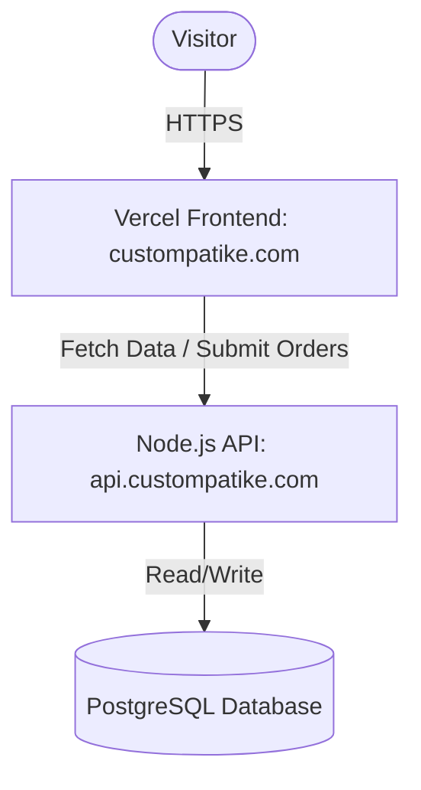

# Migration Implementation Plan: custompatike.com (Webflow to Custom Stack)

This document outlines the step-by-step technical plan to migrate the existing **`custompatike.com`** website (currently hosted on Webflow CMS & Builder) to the new 100% custom web application stack (Vercel Frontend + Node.js/PostgreSQL Droplet Backend).

---

## 1. Architecture Overview



*   **Frontend (Vercel):** Pre-compiled static HTML pages with client-side JavaScript for dynamic elements (Cart, Checkout, Analytics).
*   **Backend (DigitalOcean Droplet):** Express.js server providing REST APIs for products, orders, abandoned carts, and email delivery.
*   **Database (PostgreSQL):** Relational database storing product catalogs, user accounts, and transactional order ledgers.

---

## 2. Phase-by-Phase Migration Plan

### Phase 1: Database & CMS Migration
The objective of this phase is to move all catalog data out of the Webflow CMS into the PostgreSQL database.

1.  **Export Webflow CMS Data:**
    *   Log in to the Webflow designer for `custompatike.com`.
    *   Navigate to the **CMS Collections** panel.
    *   Export the `Products` collection to a CSV file.
2.  **Import into PostgreSQL:**
    *   Prepare the PostgreSQL schema (run `create_products.sql` on the production database).
    *   Create a data migration script (e.g. `scripts/migrate-cms.js`) to parse the Webflow CSV and insert entries into the `products` table.
3.  **Media Assets Migration:**
    *   Download all product images from the Webflow export.
    *   Upload images to a persistent public directory on the droplet (`/images/products`) or to a cloud object store (e.g., DigitalOcean Spaces).
    *   Map the new asset URLs to the `image_url` fields in the `products` database.

---

### Phase 2: Frontend Replication & Customizer Integration
Replicate the design and UX of the Webflow builder into the custom static HTML templates.

1.  **Layouts & Stylesheets:**
    *   Ensure all custom typography (e.g. Google Fonts) and CSS variables are set up in `css/style.css`.
    *   Build standard layouts for:
        *   **`index.html`** (Homepage)
        *   **`shop.html`** (Collection grid)
        *   **`footwear.html` & `leatherwear.html`** (Categorized lists)
2.  **Product Detail Templates:**
        *   **`product-footwear.html`** (Sizing options, rope laces customizer)
        *   **`product-leatherwear.html`** (Real size chart popup, made-to-measure input option)
3.  **Cart & Checkout Integration:**
    *   Configure cart states inside client-side JS to store items in `localStorage`.
    *   Connect the Checkout button to the custom endpoint `/api/checkout` to handle transactions (Stripe or cash-on-delivery).

---

### Phase 3: Static Page Generation & Localization
Generate the final HTML pages and translate them.

1.  **Static Product Builder (`build-products.js`):**
    *   Run `node build-products.js` locally.
    *   This script fetches the newly imported products from the Node API and compiles them into individual static pages under `products/footwear/` and `products/leatherwear/`.
2.  **Internationalization Compiler (`build-i18n.js`):**
    *   Add translation strings in `translations/[lang].json` files.
    *   Run the command:
        ```powershell
        node build-i18n.js
        ```
    *   This compiles all static HTML pages into language-specific folders (e.g. `/hr/`, `/de/`, `/fr/`) and updates the global `sitemap.xml` with proper SEO `hreflang` alternates.

---

## 3. Deployment & DNS Cutover (Go-Live)

To launch the site without downtime, follow these exact DNS switchover steps:

1.  **Set Up Vercel Domain Configuration:**
    *   In Vercel, navigate to **Project Settings** > **Domains**.
    *   Add `custompatike.com` and `www.custompatike.com`.
2.  **DNS Zone File Updates (At your domain registrar):**
    *   **Delete** old Webflow `A` records (usually pointing to `75.2.60.5` and `99.83.190.102`).
    *   **Delete** old Webflow `CNAME` records.
    *   **Add** Vercel `A` Record:
        *   Host: `@`
        *   Value: `76.76.21.21`
    *   **Add** Vercel `CNAME` Record:
        *   Host: `www`
        *   Value: `cname.vercel-dns.com`
3.  **Point the API Subdomain:**
    *   Add an `A` record for the backend:
        *   Host: `api`
        *   Value: `[DigitalOcean Droplet IP]`
4.  **SSL Certificate Setup:**
    *   Vercel will auto-generate the frontend SSL certificate once DNS propagates.
    *   On the Droplet, run Certbot to secure the API subdomain:
        ```bash
        sudo certbot --nginx -d api.custompatike.com
        ```

---

## 4. Verification Checklist

- [ ] Verify homepage loads correctly under HTTPS on `custompatike.com`.
- [ ] Confirm `/shop` filters return products pulled directly from PostgreSQL.
- [ ] Test the checkout flow end-to-end to ensure order payload is correctly logged in the database and a customer confirmation email is delivered via Resend.
- [ ] Verify sitemap entries point to correct hreflang alternate pages.
- [ ] Check mobile navigation drawers and made-to-measure forms are fully responsive.
